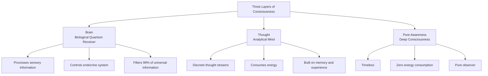

# The Architecture of Consciousness

Your brain is not the source of consciousness—it's a receiver.

Most people spend their entire lives trapped in the surface layer of mental activity—thoughts racing one after another, never stopping. They assume this constant chatter is "who they are," never realizing that behind the thoughts lies something deeper, more expansive, more fundamental.

## The Three-Layer Structure of Consciousness

Consciousness isn't a single entity. It's a layered system. Understanding this architecture is the foundation for all mindfulness, meditation, and awareness practices.



### Layer 1: The Brain — A Biological Quantum Receiver

Your brain contains 86 billion neurons, processing approximately 400 billion bits of information per second. Yet your conscious awareness perceives only about 2,000 bits.

What does this mean? The brain acts as a filter. It screens out 99.9999995% of universal information, allowing only a narrow slice of 3D reality and linear time into your awareness.

This isn't a flaw—it's a survival mechanism. If all information flooded in simultaneously, you would collapse.

But this mechanism creates a problem: the "reality" you perceive is just an extremely narrow slice of what actually exists.

**Key insight:** When brain damage alters personality, it's like smashing a radio—the music doesn't disappear, the device just can't play it anymore. The brain is consciousness's receiver, not its producer.

### Layer 2: Thought — The Analytical Mind

Thoughts are discrete, rapid, directional, and importantly—they consume energy.

Modern science calls this "cognitive processing" or "mental activity." It's built on experience, education, memory, and desire—tools for navigating 3D reality.

When you think intensely, your prefrontal cortex becomes highly active, consuming significant glucose. "Mental exhaustion" isn't metaphor—it's metabolic fact.

**Characteristics of Thought:**
- Discrete, jumping streams
- Requires brain hardware
- Consumes glucose and oxygen
- Creates mental chatter and fatigue

### Layer 3: Pure Awareness — Deep Consciousness

This is the core of consciousness, and the most overlooked aspect.

Pure awareness has no shape, no emotion, no logic. It simply **knows**.

When you're thinking, there's a "you" watching the thinking happen. When you're angry, there's a "you" watching the anger arise. That silent observer behind everything is pure awareness.

**Characteristics of Pure Awareness:**
- Timeless, unchanging
- Zero energy consumption
- Independent of brain hardware
- Pure observer, not participant

## The Cinema Analogy

Imagine watching a movie.

- **Brain** = The projector, screen, and sound system
- **Thought** = The dramatic story playing on screen
- **Pure Awareness** = The person sitting in the audience, quietly watching everything

Most people are so absorbed in the story that they forget they're the audience. The practice of mindfulness is about stepping out of the story and reclaiming your seat as the observer.

## The Average Person's Consciousness State

In an untrained state, the consciousness system operates in a misaligned mode:

```
Thoughts dominate → Brain overloaded → Deep awareness blocked
       ↓                 ↓                    ↓
  Constant noise      Anxiety/fatigue      Wisdom inaccessible
```

Thoughts cascade like a waterfall, forcing the brain to process them endlessly, while deep awareness is completely drowned out. This is why people feel exhausted, anxious, empty—not because they lack something, but because the system runs in the wrong mode.

## What Mindfulness Actually Does

The essence of mindfulness practice isn't acquiring something new—it's adjusting how the consciousness system operates.

1. **Quiet** — Let thoughts settle
2. **Clear** — Allow the brain to recover from hyperactivity
3. **Connect** — Let deep awareness emerge and resonate with specific brain structures
4. **Unify** — Awareness infuses the brain and body with high-frequency energy, able to use thought without being consumed by it

This process is about subtraction, not addition. Relaxation, not effort. Letting go, not pursuing.

## The Science Behind It

### Neuroscience Research

Studies at major research institutions have found:

- **Default Mode Network (DMN)**: The brain's "autopilot" for rumination and self-referential thought
- **Meditation reduces DMN activity**: Experienced meditators show decreased DMN activation
- **Neuroplasticity**: Regular mindfulness practice physically changes brain structure—increased prefrontal cortex thickness, decreased amygdala size

### Brain Wave States

| State | Brain Wave | Frequency | Characteristic |
|-------|-----------|-----------|----------------|
| High alert, anxiety | Beta | 14-30 Hz | Active thoughts, energy consuming |
| Relaxed, focused | Alpha | 8-13 Hz | Thoughts settling, awareness emerging |
| Deep meditation, creativity | Theta | 4-7 Hz | Awareness dominant, deeper information accessible |
| Deep sleep, unified | Delta | 0.5-3 Hz | Awareness fully dominant, time sense disappears |

## Next Steps

- [Awareness, Thought & The Brain](/en/core/consciousness) — Deep dive into the three layers
- [The Physics of Energy Patterns](/en/core/karma) — How thoughts leave physical traces in cells
- [Human Potential Development](/en/software/potential) — Four levels of human capacity