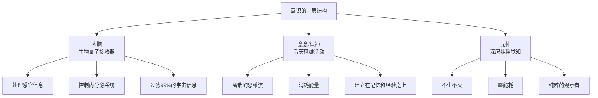

# 意识的深层结构

你的大脑不是意识本身，而是一台接收器。

大多数人终其一生被困在最表层的思维活动中——念头一个接一个，永不停歇。他们以为那就是"自己"，却从未意识到在念头背后，还有一个更深层、更广阔的存在。

## 意识的三层架构

意识不是单一的实体，而是一个分层的系统。理解这个结构，是理解一切修行、冥想、觉醒实践的基础。



### 第一层：大脑 —— 生物量子接收器

你的大脑有860亿个神经元，每秒处理约4000亿比特信息，但你的意识只能感知到其中约2000比特。

这意味着什么？大脑是一面滤网。它过滤掉了99.9999995%的宇宙信息，只允许三维世界、线性时间范围内的极小部分信息进入你的觉知。

这不是缺陷，而是生存机制。如果所有信息同时涌入，你会瞬间崩溃。

但这个机制也带来一个问题：你感知的"现实"，只是真实世界的一个极窄切片。

**关键认知：** 大脑受损导致人格改变，就像收音机砸碎了，音乐不会消失，只是设备无法播放。大脑是意识的接收器，不是意识的生产者。

### 第二层：意念 —— 后天的思维活动

意念是离散的、快速的、有方向的，最重要的是——它消耗能量。

古人称之为"识神"，现代人叫它"思维"或"念头"。它建立在经验、教育、记忆、欲望之上，用于三维世界的生存。

当你强烈思考时，前额叶皮层高度活跃，消耗大量葡萄糖。思虑伤神，不是玄学，是能量代谢的客观事实。

**意念的特征：**
- 离散的、跳跃的思维流
- 需要大脑硬件支撑
- 消耗葡萄糖和氧气
- 产生内耗和杂念

### 第三层：元神 —— 深层纯粹觉知

这是意识的核心，也是最被忽视的部分。

元神没有形状、没有情绪、没有逻辑。它只是**"知道"**。

当你在思考时，有一个"你"在看着思考发生。当你在愤怒时，有一个"你"在看着愤怒升起。那个在背后默默观察的，就是纯粹觉知。

**元神的特征：**
- 不生不灭，如如不动
- 零能耗运行
- 不依赖大脑硬件
- 是纯粹的观察者，不是参与者

## 电影院比喻

想象你在看电影。

- **大脑** = 放映机、屏幕、音响系统
- **意念** = 屏幕上跌宕起伏的剧情
- **元神** = 坐在观众席里，清醒地看着这一切的那个"观众"

大多数人沉浸在剧情里，完全忘记了观众的身份。修行者做的，就是从剧情中跳出来，找回观众的位置。

## 普通人的意识状态

在未经训练的状态下，人的意识系统处于一种错位的状态：

```
念头占据主导 → 大脑超负荷运转 → 深层觉知被屏蔽休眠
     ↓                ↓                    ↓
  内耗不断        焦虑疲惫            智慧无法显现
```

念头像瀑布一样倾泻，大脑被迫不断处理这些念头，深层觉知被彻底淹没。这就是为什么人们感到疲惫、焦虑、空虚——不是因为缺少什么，而是因为系统运行在错误的模式下。

## 修行的本质

修行的本质，不是获得什么新的东西，而是调整意识系统的运行模式。

1. **安静** — 让念头平息
2. **清理** — 让大脑从过度活跃状态中恢复
3. **接通** — 让深层觉知浮现，与大脑特定结构同频共振
4. **合一** — 觉知带着高维能量注入大脑和肉体，随时调用思维但不被其裹挟

这个过程不是增加，而是减少。不是努力，而是放松。不是追求，而是放下。

## 下一步

- [觉知、念头与大脑](/zh/core/consciousness) — 深入理解三层意识的运作机制
- [德与业的物理学](/zh/core/karma) — 念头如何在细胞层面造成损伤
- [人体潜能开发](/zh/software/potential) — 意识觉醒后的四个潜能层级